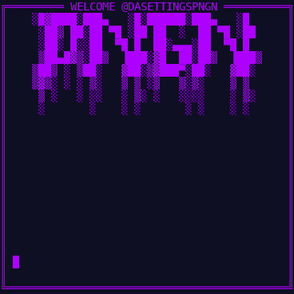
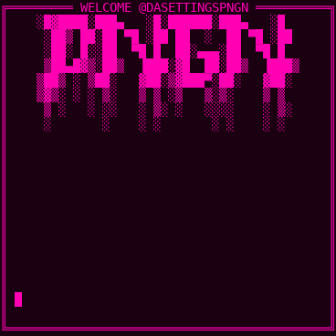
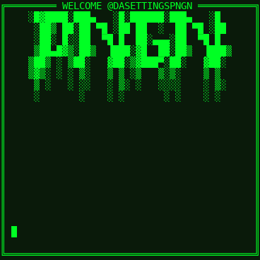

# 🐧 PNGN Terminal Animator

**Terminal-style animation renderer for creating Discord GIFs**

This project renders terminal animations as images and GIFs with team-themed colors, visual effects, and emoji support. Built for creating Discord bot content and social media animations.


---

## What This Does

Creates terminal-style animations with three color themes (purple, pink, green), visual effects like glitch and corruption, full markdown rendering, and proper emoji handling. Outputs static images or animated GIFs optimized for Discord's file size limits.

The renderer uses a deterministic animation system where the same content produces the same animation pattern every time. This makes testing and debugging straightforward.

---

## Examples

Three team themes with loading animation:

| PNGN (Purple) | KLLR (Pink) | SHMA (Green) |
|---------------|-------------|--------------|
|  |  |  |

Each theme features unique colors and visual styling optimized for Discord display.

## Installation

Install Python dependencies:

```bash
git clone https://github.com/yourusername/pngn-terminal-animator.git
cd pngn-terminal-animator
pip install -r requirements.txt
```

**Required**
- numpy (version 1.20.0 or later)
- Pillow (version 9.0.0 or later)

**Optional**
- wcwidth (for accurate Unicode width calculation)

On Debian/Ubuntu, install fonts for best results:

```bash
sudo apt-get install fonts-dejavu-core
```

---

## Basic Usage

### Single Frame

```python
from terminal import create_terminal

terminal = create_terminal()

frame = terminal.render(
    content="Hello, Terminal!",
    personality="PNGN",
    frame=0
)

frame.save("output.png")
```

Run the basic example:

```bash
python example_basic.py
```

### Animated GIF

```python
from terminal import create_terminal

terminal = create_terminal()
frames = []

for i in range(60):
    progress = i / 60
    bar = "█" * int(30 * progress) + "░" * int(30 * (1 - progress))
    
    frame = terminal.render(
        content=f"[{bar}] {int(progress * 100)}%",
        personality="PNGN",
        frame=i
    )
    frames.append(frame)

frames[0].save(
    "animation.gif",
    save_all=True,
    append_images=frames[1:],
    duration=83,
    loop=0
)
```

Run the GIF examples:

```bash
python example_gif.py
```

This creates three GIFs: loading bar, text reveal, and glitch effect demo.

---

## Color Themes

### PNGN (Purple)

```python
frame = terminal.render(content="Text", personality="PNGN")
```

Electric purple theme with digital aesthetic. Colors: PNGN Purple (191, 0, 255), Neon Violet, Ultra Violet, Void Black background.

### KLLR (Pink)

```python
frame = terminal.render(content="Text", personality="KLLR")
```

Hot pink theme with gradient effects. Colors: KLLR Pink (255, 0, 215), Electric Fuschia, Neon Magenta, Blood Black background.

### SHMA (Green)

```python
frame = terminal.render(content="Text", personality="SHMA")
```

Neon green theme with toxic styling. Colors: Neon Green (0, 255, 0), Toxic Lime, Radiation Green, Toxic Black background.

---

## Visual Effects

Effects trigger at deterministic moments based on content hash. Same content always produces same effect pattern.

### Glitch

```python
frame = terminal.render(
    content="Text",
    effects=["glitch"],
    frame=i
)
```

Brief digital artifacts on specific frames.

### Corruption

```python
frame = terminal.render(
    content="Text",
    effects=["corruption"],
    frame=i
)
```

Characters replaced with corruption symbols during animation bursts.

### Static

```python
frame = terminal.render(
    content="Text",
    effects=["static"],
    frame=i
)
```

TV-style static noise with pulsing intensity.

### Combined

```python
frame = terminal.render(
    content="Text",
    effects=["glitch", "corruption", "static"],
    frame=i
)
```

---

## Markdown Support

```python
content = """
# Header 1
## Header 2

**Bold text** and *italic text*

`inline code` and code blocks:

```python
def example():
    return "code"
```

[Links](https://example.com) work too
"""

frame = terminal.render(content=content, personality="PNGN")
```

Run markdown example:

```bash
python example_markdown.py
```

Supports headers, bold, italic, inline code, code blocks, and links.

---

## Width Calculator

The pngn_width module calculates accurate text widths for terminal layouts:

```python
from pngn_width import get_width

width = get_width("Hello")        # Returns: 5
width = get_width("你好")          # Returns: 4 (CJK)
width = get_width("Hello 👋")      # Returns: 8 (emoji)
```

Features thread-safe caching, handles Unicode properly, and works with or without the wcwidth library.

---

## Configuration

### Terminal Size

```python
terminal = create_terminal(
    terminal_width=80,
    height=40
)
```

Default is 46x23 characters.

### Character Size

Edit `config.py`:

```python
CHAR_WIDTH = 8
CHAR_HEIGHT = 16
```

### Colors

Access the 32-color palette:

```python
from config import PNGN_32_COLORS

purple = PNGN_32_COLORS[0]['rgb']  # (191, 0, 255)
pink = PNGN_32_COLORS[8]['rgb']    # (255, 0, 215)
green = PNGN_32_COLORS[16]['rgb']  # (0, 255, 0)
```

### Effect Characters

Customize in `config.py`:

```python
GLITCH_CHARS = "▒▓░░▄▀▌▐┼╬▪▫"
CORRUPTION_CHARS = "▨▓▒░▄▀▌▐"
```

---

## Discord Optimization

### Recommended Settings

```python
frames[0].save(
    "discord.gif",
    save_all=True,
    append_images=frames[1:],
    duration=83,      # 12 FPS
    loop=0,
    optimize=True
)
```

**Guidelines**
- 60-120 frames (5-10 seconds) keeps files under 8MB
- 12 FPS provides smooth animation
- Default 46x23 size works well for inline display
- The 32-color palette naturally reduces file size

---

## Troubleshooting

### Font Not Found

Install DejaVu fonts:

```bash
sudo apt-get install fonts-dejavu-core
```

Or place fonts in `fonts/DejaVuSansMono.ttf`.

### Emoji Not Rendering

Place 16x16 PNG files in `fonts/emoji/16x16/` named by Unicode codepoint (e.g., `1f4a5.png`).

### Better Unicode Support

```bash
pip install wcwidth
```

The width calculator works without it but wcwidth improves accuracy.

---

## File Structure

```
pngn-terminal-animator/
├── terminal.py           Main renderer
├── config.py             Colors and settings
├── pngn_width.py         Width calculator
├── requirements.txt      Dependencies
├── README.md             This file
├── CHANGELOG.md          Version history
├── LICENSE               MIT license
├── example_basic.py      Basic usage
├── example_gif.py        GIF creation
├── example_markdown.py   Markdown demo
└── fonts/
    └── DejaVuSansMono.ttf
```

---

## How It Works

The renderer processes text through several stages:

1. Markdown detection and region marking
2. Text to render instructions with styling
3. Effect application based on frame number
4. ANSI conversion with color codes
5. Bitmap rendering with PIL
6. Team border application

Effects use content hash to generate pseudo-random but deterministic timing, so animations are reproducible.

The width calculator measures text accurately by checking each character's display width, handling CJK characters (2 cells), emoji (2 cells), and combining marks (0 cells).

---

## Contact

**Jesse Vogeler-Wunsch** @ PNGN-Tec LLC

Reach me on Discord: **@DaSettingsPNGN**

Part of the PNGN performance systems suite for resource-constrained environments.

---

*Built on a phone. Optimized for mobile-first performance.*

## License

MIT License. See LICENSE file.

---
